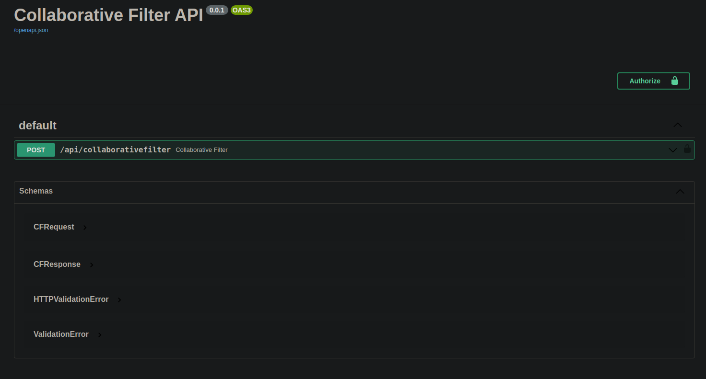
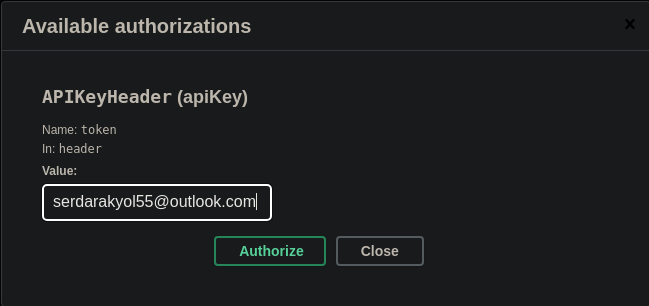
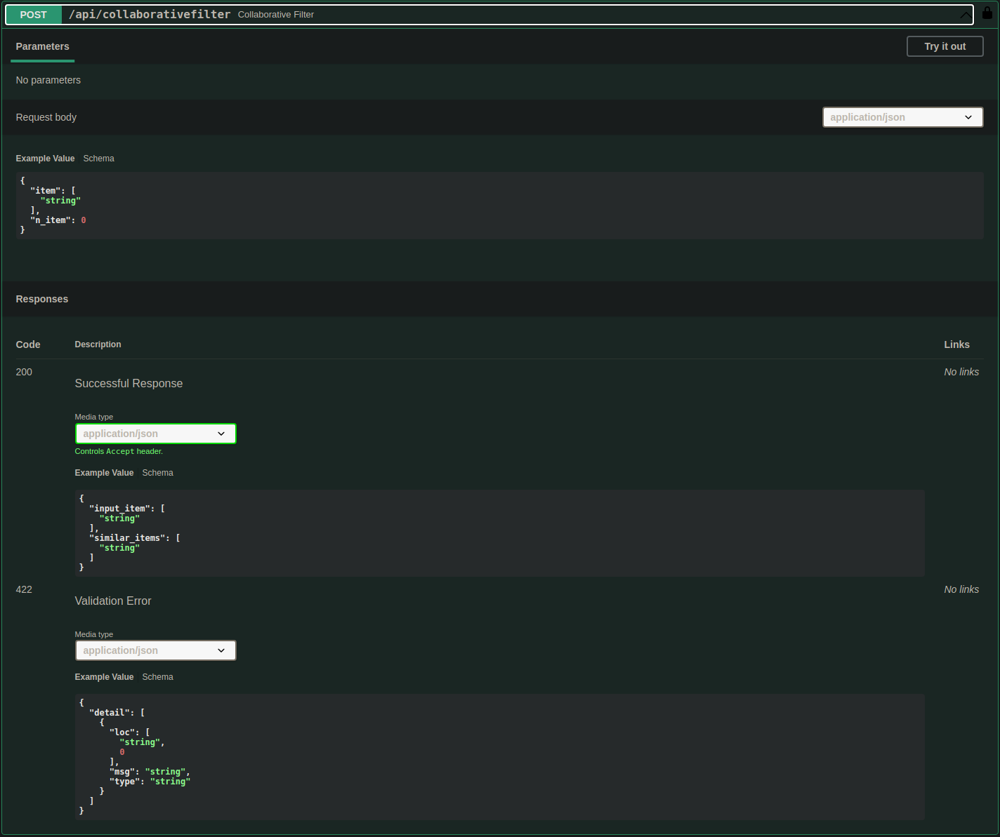
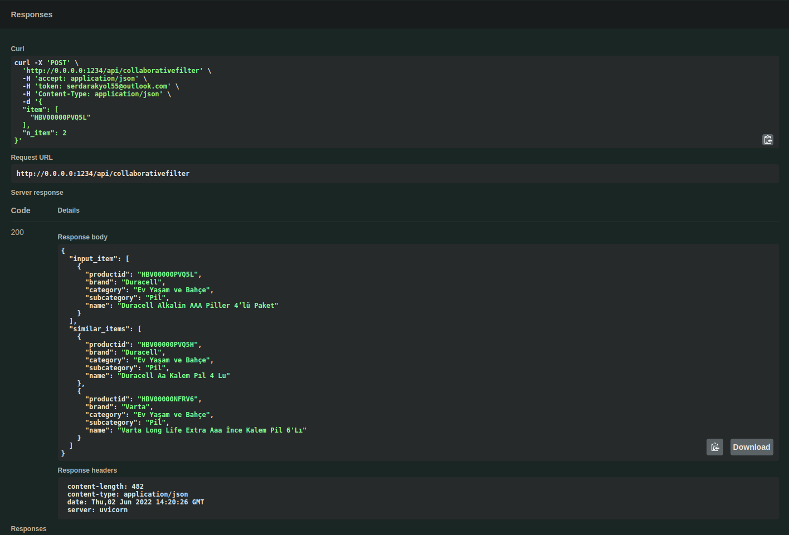

# Recommendation system for e-commerce (Session based Collaborative Filtering)
This repository contains continuation of [Collaborative Filtering Data Preparetion](https://github.com/serdarakyol/Collaborative-filtering-data-preparation). Used the data which generated Collaborative Filtering Data Preparetion and created an API with FastAPI.

For that project used over 10K products and 54K session

# Run time test
Each request is unique, contain n different product and returns n products for recommend. Please note that, the project tested on **12th Gen Intel(R) Core(TM) i7-12700H** CPU. For that CPU. Runtime table as below
Number of API Request | Average latency (ms) | Lowest latency (ms) | Highest latency (ms) | n product per request | n product per response
--- | --- | --- | --- | --- | ---
100 | 44 | 38 | 77 | 10 | 10
1000 | 44 | 38 | 81 | 5 | 5
3000 | 45 | 38 | 83 | 3 | 3

# Usage
That project developed on Python 3.9. For run that repository, just run below code
## Run on Terminal
```
$ git clone https://github.com/serdarakyol/session-based-CF-API.git
$ cd session-based-CF-API/
$ bash prepare_api.sh
$ source venv/bin/activate
$ uvicorn cf_api.main:app --reload --host 0.0.0.0 --port 1234
```
Please note that prepare_api.sh creates necessary folders, download files and fill to make ready to API. For more information [click](prepare_api.sh)

If you do not want to run API like that. You can just use Docker as below code section
## Run on Docker
```
$ docker image build -t cf_api:0.0.1 .
$ docker run -dp 1234:1234 cf_api:0.0.1
```
## How to use API
So far, setup completed. Follow description to use this API

Then go to http://0.0.0.0:1234/docs. Click ```Authorize``` button, located on the right up corner. You can see on below image


Write on popup screen ```serdarakyol55@outlook.com``` as below image. Then click Authorize and Close button.


Click on ```POST /api/collaborativefilter``` and new screen will appear as below. Click on ```Try it out``` which located on the right corner. As you can see on the below image you can write any product ID and number of suggestion product. 



When the input data is written, just click on the ```execute```. Then the results will show up as below image



<!-- LICENSE -->
## License

[session-based-CF-API](https://github.com/serdarakyol/session-based-CF-API) is distributed under the [MIT License](LICENSE).
